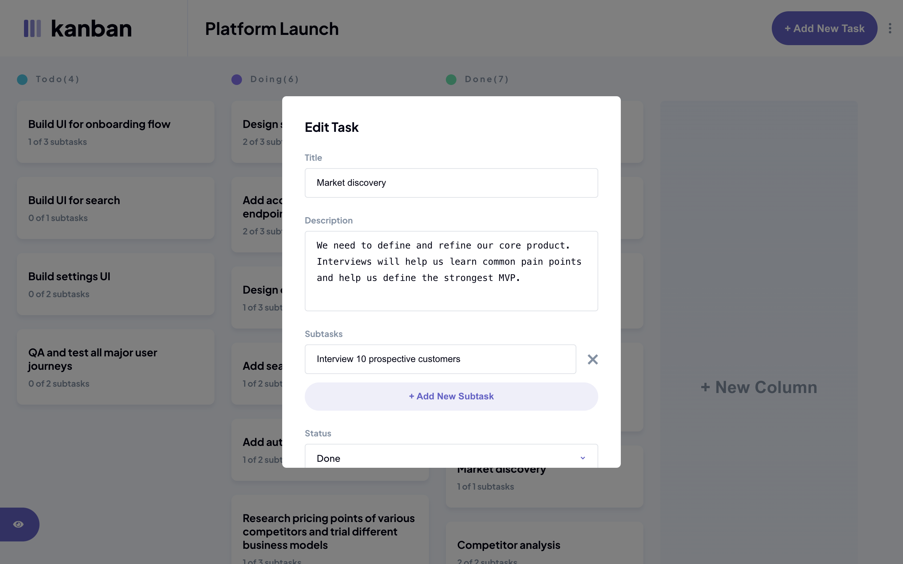

<a name="readme-top"></a>

<div align="center">
    <h1>Kanban task management web app</h1>
    <p>
        This is a solution to the
        <a href="https://www.frontendmentor.io/challenges/kanban-task-management-web-app-wgQLt-HlbB">Kanban task management web app challenge on Frontend Mentor</a>
        .
    </p>
    <p>
        <a href="https://yuna9068.github.io/kanban-task-management/">Github Live Site URL</a>
        ·
        <a href="https://www.frontendmentor.io/solutions/kanban-task-management-web-app-hfdpjV9nYs">Frontend Mentor Solution URL</a>
    </p>
</div>


<p align="center"><a href="https://yuna9068.github.io/kanban-task-management/about">中文</a></p>


## Table of contents

* [Features](#features)
* [Screenshot](#screenshot)
* [Built with](#built-with)
* [Getting Started](#getting-started)
    * [Prerequisites](#prerequisites)
    * [Installation](#installation)
* [Acknowledgments](#acknowledgments)
* [Author](#author)


## Features

* View the optimal layout for the app depending on their device's screen size
* See hover states for all interactive elements on the page
* Create, read, update, and delete boards and tasks
* Receive form validations when trying to create/edit boards and tasks
* Mark subtasks as complete and move tasks between columns
* Hide/show the board sidebar
* Toggle the theme between light/dark modes
* Allow users to drag and drop
  *  boards icon to re-order them in the Sidebar
  *  columns to re-order them in a board
  *  tasks to change their status and re-order them in a column
  *  subtasks to re-order them in the task detail modal
* Keep track of any changes, even after refreshing the browser (use `localStorage`)
* When creating/editing boards and tasks, show confirmation dialog before leaving the page

<p align="right"><a href="#readme-top">⬆︎ BACK TO TOP</a></p>


## Screenshot

<table>
    <tr>
        <td>
            <p>Index - Light Mode</p>
            
        </td>
        <td>
            <p>Index - Dark Mode</p>
            
        </td>
    </tr>
    <tr>
        <td>
            <p>Edit Board</p>
            
        </td>
        <td>
            <p>Task Detail</p>
            
        </td>
    </tr>
    <tr>
        <td>
            <p>Edit Task</p>
            
        </td>
    </tr>
</table>


<details>
  <summary>GIF</summary>
  <table>
    <tr>
        <td>
            <p>Index</p>
            
        </td>
        <td>
            <p>Task</p>
            
        </td>
    </tr>
    <tr>
        <td>
            <p>Form Validation</p>
            
        </td>
        <td>
            <p>Leave Alert</p>
            
        </td>
    </tr>
    <tr>
        <td>
            <p>Theme Switcher</p>
            
        </td>
        <td>
        </td>
    </tr>
  </table>
</details>


<p align="right"><a href="#readme-top">⬆︎ BACK TO TOP</a></p>


## Built with

* [Vue 3](https://vuejs.org): JavaScript Framework
* [Vue Router 4](https://router.vuejs.org): Official router for Vue
* [Pinia 2](https://pinia.vuejs.org): Store library for Vue
* [Nuxt 3](https://nuxt.com): Vue Framework
* [SCSS](https://sass-lang.com): CSS extension language
* [VueUse](https://vueuse.org): Collection of Vue Composition Utilities
* [VueDraggablePlus](https://alfred-skyblue.github.io/vue-draggable-plus): Drag and drop components
* [nuxt-svgo](https://github.com/cpsoinos/nuxt-svgo): Nuxt module to load optimized SVG files as Vue components
* [Nuxt Google Fonts](https://google-fonts.nuxtjs.org/): Google Fonts module for Nuxt
* [@antfu/eslint-config](https://github.com/antfu/eslint-config): Code style

<p align="right"><a href="#readme-top">⬆︎ BACK TO TOP</a></p>


## Getting Started

To get a local copy up and running follow these simple example steps.

### Prerequisites
* [Node.js](https://nodejs.org) version 18.0.0 or newer

### Installation
1. Clone the repo
    ```sh
    git clone https://github.com/yuna9068/kanban-task-management.git
    ```
2. Install NPM packages
    ```sh
    npm install
    ```
3. Compile and Hot-Reload for Development
    ```sh
    npm run dev
    ```

<p align="right"><a href="#readme-top">⬆︎ BACK TO TOP</a></p>


## Acknowledgments

* Theme Switcher
    * [**實作網頁深色模式及淺色模式的切換** by Mark](https://blog.tarswork.com/post/implement-dark-mode-and-light-mode-for-web-pages)
    * [**Dark Theme Switcher in Vue.js** by yestellar](https://github.com/yestellar/vue_theme_switcher#dark-theme-switcher-in-vuejs)
* [**Best-README-Template** by othneildrew](https://github.com/othneildrew/Best-README-Template)

<p align="right"><a href="#readme-top">⬆︎ BACK TO TOP</a></p>


## Author

* GitHub - [Yuna](https://github.com/yuna9068)
* Frontend Mentor - [@yuna9068](https://www.frontendmentor.io/profile/yuna9068)

<p align="right"><a href="#readme-top">⬆︎ BACK TO TOP</a></p>
